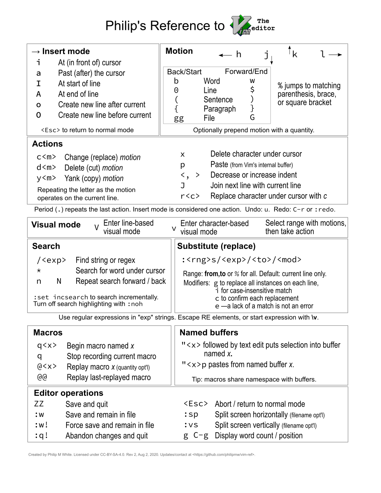

# Philip's reference to Vim text editor #

Vim is a powerful, ubiquitous, light-weight, and free text editor.
People's biggest complaint is that Vim has a steep learning curve.
I am happy to share with you a one-page reference I made to help you be productive sooner.

## Contributions

I welcome contributions and improvements to this reference.

The source document is `source.svg`.
I made it with [Inkscape](https://inkscape.org) 1.0 on macOS 10.15.6.

Ensure that you have the necessary fonts on your system: Arial, Arial Narrow, and Source Code Pro.

ZZ
